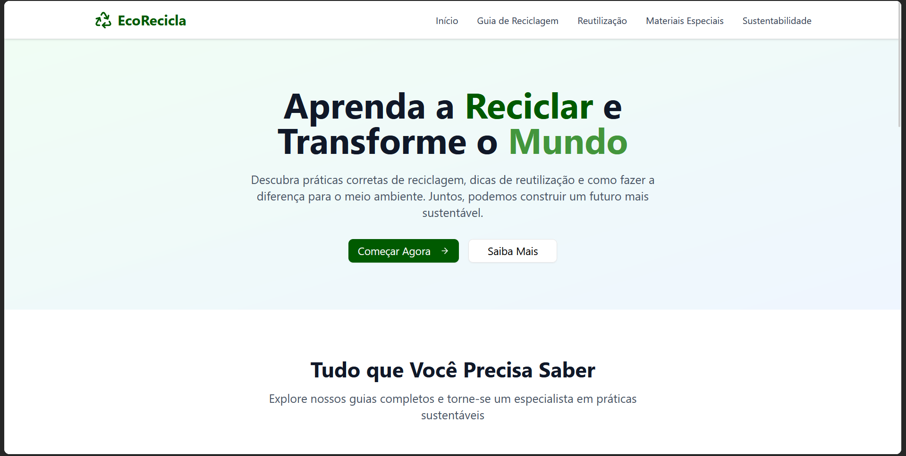
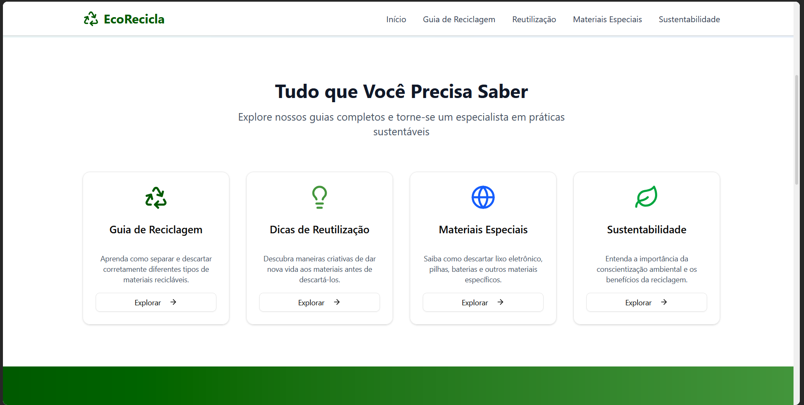

# EcoRecicla

## Sobre o Projeto

O **EcoRecicla** é um web app educativo desenvolvido com o objetivo de promover a conscientização ambiental e incentivar práticas sustentáveis na comunidade. Ele serve como um guia acessível para o descarte correto de materiais recicláveis e oferece dicas práticas de reutilização.

## Objetivos

*   **Oferecer instruções acessíveis sobre o descarte de materiais recicláveis:** Fornecer informações claras e fáceis de entender sobre como separar e descartar diferentes tipos de resíduos.
*   **Promover a conscientização ambiental na comunidade:** Educar os usuários sobre a importância da reciclagem e seus impactos positivos no meio ambiente.
*   **Incentivar a adoção de hábitos sustentáveis por meio de dicas práticas de reutilização de materiais:** Apresentar ideias criativas para dar uma nova vida a materiais que seriam descartados, promovendo a economia circular e a redução de resíduos.

## Funcionalidades Principais

*   **Guia de Reciclagem:** Seções detalhadas sobre o descarte correto de papel, plástico, vidro e metal, incluindo exemplos e dicas.
*   **Informações sobre Materiais Especiais:** Orientação para o descarte de itens como lixo eletrônico, pilhas, baterias e óleo de cozinha.
*   **Dicas de Reutilização:** Ideias criativas para reaproveitar diversos materiais no dia a dia.
*   **Impacto da Reciclagem:** Estatísticas e informações sobre os benefícios da reciclagem para o meio ambiente e a sociedade.
*   **Design Intuitivo:** Interface limpa, moderna e responsiva, com uma paleta de cores que remete à sustentabilidade.

## Tecnologias Utilizadas (Frontend)

*   **React:** Biblioteca JavaScript para construção de interfaces de usuário.
*   **Vite:** Ferramenta de build rápida para projetos web.
*   **Tailwind CSS:** Framework CSS utilitário para estilização rápida e responsiva.
*   **Lucide React:** Biblioteca de ícones para elementos visuais.

O EcoRecicla visa ser uma ferramenta prática e inspiradora para todos que desejam contribuir para um futuro mais verde e sustentável.